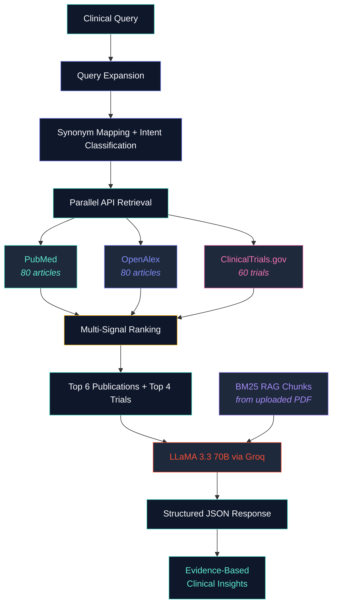

<div align="center">

<!-- Animated gradient header -->


<br/>

<picture>
  <source media="(prefers-color-scheme: dark)" srcset="https://readme-typing-svg.demolab.com?font=Inter&weight=400&size=16&duration=4000&pause=1200&color=94A3B8&center=true&vCenter=true&multiline=true&repeat=true&width=600&height=50&lines=AI-Powered+Medical+Research+Assistant;Retrieve+%E2%80%A2+Rank+%E2%80%A2+Synthesize+%E2%80%A2+Cite">
  
</picture>

<br/><br/>

[](https://curalink-ai-medical-research.manvikms318.workers.dev)
&nbsp;
[](https://github.com/Manwikkk/curalink_ai_medical_research)

<br/>


</div>

<br/>

---

## About

**Curalink** is a full-stack **Retrieval-Augmented Generation (RAG)** application that enables clinicians and researchers to query real-time medical literature and receive **structured, citation-backed clinical insights** — powered by live data from three authoritative biomedical sources and synthesized through a 70-billion-parameter language model.

Upload a patient PDF report, and Curalink will connect the document's clinical findings directly to the latest peer-reviewed research — producing personalized, actionable insights grounded in evidence.

---

## Pipeline

<div align="center">



</div>

---

## Key Features

<table>
<tr>
<td width="50%">

### Multi-Source Evidence Retrieval
Queries **PubMed**, **OpenAlex**, and **ClinicalTrials.gov** in parallel — retrieving up to **220 results** per query, then intelligently ranking and deduplicating them.

### RAG Pipeline with BM25
Upload patient PDFs — sentence-aware chunking (450 tokens, 100-token overlap) — **Okapi BM25 scoring** retrieves the most relevant excerpts — LLM synthesizes personalized insights.

### Biomarker & Mutation Detection
Automatically extracts **EGFR, KRAS, BRCA, PD-L1, staging, histology**, and drug mentions from uploaded reports using pattern-based NLP.

</td>
<td width="50%">

### Intelligent Query Expansion
Expands clinical queries with **disease synonyms** and **intent classification** (treatment, diagnosis, biomarker, prognosis) for higher recall across all three APIs.

### Multi-Signal Ranking Engine
Scores publications on **4 weighted signals**: keyword relevance (55%), recency decay (20%), source credibility (10%), and citation count (15%).

### Secure Authentication
**Google OAuth 2.0** + email/password with **JWT tokens**, session management, and guest mode support.

</td>
</tr>
</table>

---

## Architecture

| Layer | Technology | Deployment |
|:---|:---|:---|
| Frontend | React 19, TanStack Start, Tailwind CSS 4, Framer Motion | Cloudflare Workers |
| Backend | Node.js, Express 4, Mongoose ODM | Render |
| Database | MongoDB Atlas | AWS |
| LLM | LLaMA 3.3 70B Versatile | Groq Cloud |
| Auth | Google OAuth 2.0, JWT, bcrypt | Passport.js |

---

## Tech Stack

<div align="center">


</div>

---

## Project Structure

```
curalink/
├── curalink-backend/               # Express API Server
│   ├── controllers/
│   │   ├── authController.js       # Login, register, Google OAuth
│   │   ├── chatController.js       # Main RAG orchestration (9 steps)
│   │   ├── reportController.js     # PDF upload + in-memory processing
│   │   ├── historyController.js    # Conversation CRUD
│   │   └── settingsController.js   # User preferences
│   ├── services/
│   │   ├── pubmedService.js        # PubMed E-Utilities API
│   │   ├── openAlexService.js      # OpenAlex REST API
│   │   ├── clinicalTrialsService.js # ClinicalTrials.gov v2 API
│   │   ├── queryExpansionService.js # Synonym + intent expansion
│   │   ├── rankingService.js       # Multi-signal publication ranking
│   │   ├── ragService.js           # BM25 chunking + retrieval
│   │   └── llmService.js           # Groq LLaMA 3.3 70B inference
│   ├── models/                     # Mongoose schemas
│   ├── middleware/                  # JWT auth middleware
│   └── server.js                   # Entry point
│
├── curalink-frontend/              # React SPA
│   ├── src/
│   │   ├── components/app/         # Chat, sidebar, query composer
│   │   ├── components/landing/     # Hero, features, CTA, particles
│   │   ├── components/ui/          # Shadcn + Radix design system
│   │   ├── contexts/               # Auth (JWT + OAuth + guest)
│   │   ├── lib/                    # API client, types, utilities
│   │   └── routes/                 # TanStack file-based routing
│   ├── wrangler.jsonc              # Cloudflare Workers config
│   └── vite.config.ts
│
└── deployment_guide.md             # Step-by-step cloud deployment
```

---

## RAG Pipeline — Deep Dive

### Query Expansion
```
User: "latest treatment for lung cancer"
  ↓
Condition: "lung cancer"     Intent: "treatment"
Synonyms: ["NSCLC", "pulmonary carcinoma"]
  ↓
PubMed:   "lung cancer AND treatment AND latest"
OpenAlex: "lung cancer treatment NSCLC latest"
Trials:   "lung cancer"
```

### Parallel Retrieval
All three APIs are queried simultaneously using `Promise.allSettled()` — if one API times out, the others still return results.

| Source | Max Results | Method |
|:---|:---|:---|
| PubMed | 80 | E-Utilities XML → structured parse |
| OpenAlex | 80 | REST API → JSON |
| ClinicalTrials.gov | 60 | v2 API → JSON |

### Multi-Signal Ranking
Publications scored `[0–1]` on four weighted signals:

| Signal | Weight | Method |
|:---|:---|:---|
| Keyword Relevance | 55% | TF-match in title + abstract |
| Recency | 20% | Exponential decay, 3-year half-life |
| Source Credibility | 10% | PubMed (0.10) > OpenAlex (0.07) |
| Citation Count | 15% | Log-scaled, capped |

### Chunking Strategy
```
Sentence-Aware Overlapping Chunks
─────────────────────────────────
Chunk Size:  ~1800 chars (~450 tokens)
Overlap:     ~400 chars  (~100 tokens)
Split on:    Sentence boundaries (.!?)
Stored:      text + keyword set + TF map
```

### BM25 Retrieval
Chunks scored using **Okapi BM25** (k1=1.5, b=0.75) with IDF computed across the document's chunk collection. Top 5 chunks above a 0.1 relevance threshold are injected into the LLM context.

### LLM Synthesis
**Groq Cloud — LLaMA 3.3 70B Versatile** generates structured JSON:
```json
{
  "conditionOverview": "Evidence-based summary...",
  "personalizedInsights": "Based on your uploaded report, ...",
  "researchInsights": "Key findings from retrieved literature..."
}
```

Temperature: 0.25 · Strict no-hallucination system prompt · Automatic JSON extraction with fallback parsing

---

## Quick Start

### Prerequisites
- Node.js 18+
- MongoDB Atlas account
- Groq API key — [console.groq.com](https://console.groq.com)

### Backend
```bash
cd curalink-backend
cp .env.example .env         # Fill in credentials
npm install
npm run dev                  # Starts on :5000
```

### Frontend
```bash
cd curalink-frontend
npm install
npm run dev                  # Starts on :5173
```

---

## Deployment

| Service | Platform | Config |
|:---|:---|:---|
| Frontend | Cloudflare Workers | `wrangler.jsonc` — TanStack Start SSR |
| Backend | Render | `node server.js` — Express API |
| Database | MongoDB Atlas | Cloud cluster |

> Full instructions in [`deployment_guide.md`](./deployment_guide.md)

---

## Environment Variables

<details>
<summary><b>Backend (.env)</b></summary>

```env
NODE_ENV=production
PORT=5000
FRONTEND_URL=https://your-frontend.workers.dev
MONGODB_URI=mongodb+srv://...
JWT_SECRET=your_jwt_secret
JWT_EXPIRES_IN=7d
GOOGLE_CLIENT_ID=your_google_client_id
GOOGLE_CLIENT_SECRET=your_google_client_secret
GOOGLE_CALLBACK_URL=https://your-backend.onrender.com/api/auth/google/callback
GROQ_API_KEY=your_groq_api_key
GROQ_MODEL=llama-3.3-70b-versatile
```

</details>

<details>
<summary><b>Frontend</b></summary>

```env
VITE_API_URL=https://your-backend.onrender.com/api
```

</details>

---

<div align="center">

### Author

**Manvik**

[](https://github.com/Manwikkk)

<br/>

<sub>Built with evidence, not hallucinations.</sub>

</div>
