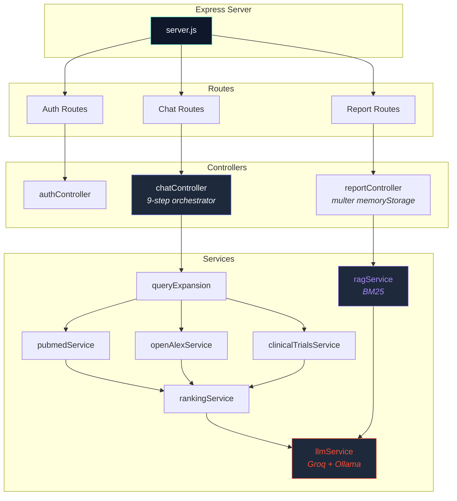

<div align="center">


<br/>

<sub>Express API · RAG Pipeline · Groq LLM · MongoDB Atlas</sub>

<br/><br/>


</div>

---

## Overview

The backend is a **Node.js + Express** API server that orchestrates the entire RAG pipeline: from query expansion and multi-source retrieval, through intelligent ranking, to LLM-powered synthesis. It serves as the intelligence layer behind the Curalink frontend.

---

## Architecture



---

## Structure

```
curalink-backend/
├── server.js                     # Entry — CORS, proxy trust, error handler
├── controllers/
│   ├── authController.js         # Register, login, Google OAuth callback
│   ├── chatController.js         # Main RAG orchestration (9-step pipeline)
│   ├── reportController.js       # PDF upload → memory processing → MongoDB
│   ├── historyController.js      # Conversation CRUD
│   └── settingsController.js     # User preferences and medical profile
├── services/
│   ├── queryExpansionService.js   # Synonym mapping + intent classification
│   ├── pubmedService.js           # PubMed E-Utilities (XML → structured)
│   ├── openAlexService.js         # OpenAlex REST API
│   ├── clinicalTrialsService.js   # ClinicalTrials.gov v2 API
│   ├── rankingService.js          # Multi-signal scoring [0–1]
│   ├── ragService.js              # BM25 chunking + retrieval + biomarker NLP
│   └── llmService.js              # Groq LLaMA 3.3 70B + Ollama fallback
├── models/
│   ├── User.js                    # User schema (profile, preferences)
│   ├── Conversation.js            # Chat history + linked reports
│   └── Report.js                  # PDF metadata, chunks, insights
├── middleware/
│   └── auth.js                    # JWT verification
├── routes/                        # Express route definitions
└── .env.example                   # Template environment config
```

---

## Pipeline (9 Steps)

The `chatController.js` runs a **9-step pipeline** on every query:

| Step | Action | Details |
|:---:|:---|:---|
| 1 | Load / Create Conversation | Retrieve prior messages for context continuity |
| 2 | Build Context | Extract condition, location, conversation history |
| 3 | Query Expansion | Synonym mapping + intent classification |
| 4 | Parallel Retrieval | `Promise.allSettled()` — PubMed, OpenAlex, ClinicalTrials |
| 5 | Rank and Deduplicate | Multi-signal scoring → top 6 pubs + top 4 trials |
| 6 | BM25 RAG Retrieval | Score uploaded PDF chunks → inject top 5 into context |
| 7 | LLM Synthesis | Groq LLaMA 3.3 70B → structured JSON response |
| 8 | Build Answer | Assemble publications, trials, sources, RAG metadata |
| 9 | Persist | Save messages + auto-generate session title |

---

## Services

### Query Expansion
- 8 disease synonym maps (lung cancer → NSCLC, SCLC, pulmonary carcinoma...)
- 7 intent classifiers (treatment, diagnosis, biomarker, prognosis...)
- Generates 3 optimized queries — one per API

### Ranking Engine
Four weighted scoring signals on a [0–1] scale:

| Signal | Weight |
|:---|:---|
| Keyword relevance (TF-match in title + abstract) | 55% |
| Recency (exponential decay, 3-year half-life) | 20% |
| Source credibility (PubMed > OpenAlex) | 10% |
| Citation count (log-scaled, capped) | 15% |

### RAG Service
- **Chunking:** Sentence-aware, ~1800 chars with 400-char overlap
- **Scoring:** Okapi BM25 (k1=1.5, b=0.75) with IDF across chunk collection
- **Biomarker NLP:** Pattern extraction for EGFR, KRAS, BRCA, PD-L1, staging, drugs

### LLM Service
- **Primary:** Groq Cloud — LLaMA 3.3 70B Versatile (temperature=0.25)
- **Fallback:** Local Ollama (LLaMA 3.2)
- **Output:** Strict JSON with automatic cleanup and fallback parsing

---

## API Endpoints

| Method | Endpoint | Auth | Description |
|:---|:---|:---|:---|
| POST | `/api/auth/register` | No | Create account |
| POST | `/api/auth/login` | No | Email/password login |
| GET | `/api/auth/google` | No | Google OAuth redirect |
| POST | `/api/chat` | Yes/Guest | Send query → RAG pipeline |
| GET | `/api/history` | Yes | List conversations |
| POST | `/api/upload-report` | Yes | Upload PDF for RAG |
| GET | `/api/upload-report/:id` | Yes | Check processing status |
| PUT | `/api/settings` | Yes | Update preferences |

---

## Security

- **Helmet** — HTTP security headers
- **CORS** — Strict origin validation against `FRONTEND_URL`
- **Rate Limiting** — API request throttling
- **Trust Proxy** — Correct client IP behind load balancer
- **bcrypt** — Password hashing (salt rounds: 12)
- **JWT** — Stateless authentication tokens

---

## Quick Start

```bash
cp .env.example .env     # Fill in credentials
npm install
npm run dev              # nodemon on :5000
```

---

<div align="center">
<sub>Part of the Curalink project</sub>
</div>
