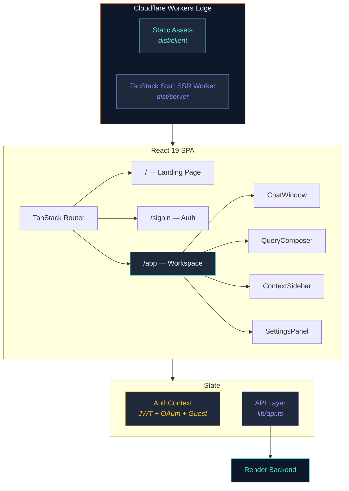

<div align="center">


<br/>

<sub>React 19 · TanStack Start · Tailwind CSS 4 · Cloudflare Workers</sub>

<br/><br/>


</div>

---

## Overview

The frontend is a **React 19** single-page application built with **TanStack Start** (file-based routing + SSR), styled with **Tailwind CSS 4**, and deployed as a **Cloudflare Worker** for edge-rendered performance. It features a premium dark-mode research workspace with real-time chat, PDF upload, and an interactive evidence viewer.

---

## Architecture



---

## Structure

```
curalink-frontend/
├── src/
│   ├── components/
│   │   ├── app/                       # Research Workspace
│   │   │   ├── ChatWindow.tsx         # Message thread + streaming UI
│   │   │   ├── QueryComposer.tsx      # Query input + condition selector
│   │   │   ├── AnswerView.tsx         # Structured AI response renderer
│   │   │   ├── ContextSidebar.tsx     # Active sources + report status
│   │   │   ├── ConversationsSidebar.tsx # Session history panel
│   │   │   ├── SettingsPanel.tsx      # Medical profile + AI preferences
│   │   │   ├── ReportUploadCard.tsx   # PDF drag-and-drop uploader
│   │   │   ├── PublicationCard.tsx    # Publication result card
│   │   │   ├── TrialCard.tsx          # Clinical trial card
│   │   │   ├── SourceCard.tsx         # Source attribution badge
│   │   │   └── AppTopBar.tsx          # Navigation + session controls
│   │   │
│   │   ├── landing/                   # Landing Page
│   │   │   ├── Hero.tsx               # Animated hero section
│   │   │   ├── Features.tsx           # Feature showcase grid
│   │   │   ├── HowItWorks.tsx         # Pipeline visualization
│   │   │   ├── Stats.tsx              # Live statistics counters
│   │   │   ├── CTA.tsx                # Call-to-action
│   │   │   ├── Footer.tsx             # Footer with citations
│   │   │   ├── ParticleBackground.tsx # Animated particle canvas
│   │   │   └── MagneticCursor.tsx     # Interactive cursor effect
│   │   │
│   │   ├── ui/                        # Shadcn + Radix Design System
│   │   │   └── (30+ reusable components)
│   │   │
│   │   ├── AnimatedBackdrop.tsx       # Global animated gradient
│   │   ├── Logo.tsx                   # Activity icon + Curalink brand
│   │   └── SourceBadgePill.tsx        # PubMed / OpenAlex / Trial badges
│   │
│   ├── contexts/
│   │   └── AuthContext.tsx            # JWT + Google OAuth + guest mode
│   │
│   ├── lib/
│   │   ├── api.ts                     # Centralized API client
│   │   ├── types.ts                   # TypeScript interfaces
│   │   ├── mock-data.ts              # Development fixtures
│   │   └── utils.ts                   # cn() + helpers
│   │
│   ├── routes/                        # TanStack File-Based Routing
│   │   ├── __root.tsx                 # Root layout + head meta
│   │   ├── index.tsx                  # Landing page (/)
│   │   ├── signin.tsx                 # Auth page (/signin)
│   │   └── app.tsx                    # Research workspace (/app)
│   │
│   └── styles.css                     # Global Tailwind + custom styles
│
├── public/
│   └── favicon.svg                    # Activity heartbeat icon
├── wrangler.jsonc                     # Cloudflare build config
├── wrangler.deploy.json               # Cloudflare deploy config
├── vite.config.ts                     # Vite + TanStack + Cloudflare plugin
└── tsconfig.json
```

---

## UI Features

<table>
<tr>
<td width="50%">

### Animated Landing Page
- Particle background canvas
- Magnetic cursor interaction
- Framer Motion page transitions
- Animated statistics counters

### Research Workspace
- Real-time chat with structured AI responses
- Inline publication cards with metadata
- Clinical trial cards with phase/status badges
- Source attribution pills

</td>
<td width="50%">

### PDF Upload and RAG
- Drag-and-drop file upload
- Real-time processing progress bar
- Report summary + extracted biomarkers
- Personalized insights in AI responses

### Settings and Profile
- Medical specialty selector
- Condition of interest
- AI preferences (max publications, max trials)
- Dark mode throughout

</td>
</tr>
</table>

---

## Authentication Flow

```
Email/Password ─── bcrypt hash ──→ JWT token ──→ localStorage
Google OAuth ───── Passport ─────→ callback ──→ JWT ──→ redirect /app
Guest Mode ─────── no auth ──────→ ephemeral session (no persistence)
```

- `AuthContext` manages token lifecycle, guest flag clearing on OAuth, and user state
- Guest-to-authenticated transition clears the `curalink_guest` flag automatically

---

## Deployment

The frontend deploys as a **Cloudflare Worker** using TanStack Start SSR:

```
Build:  npm run build → dist/server/ (Worker) + dist/client/ (assets)
Deploy: wrangler deploy --config wrangler.deploy.json
```

Two separate wrangler configs:
- `wrangler.jsonc` — source entry for `@cloudflare/vite-plugin` during build
- `wrangler.deploy.json` — built output paths for `wrangler deploy`

### Environment
```env
VITE_API_URL=https://your-backend.onrender.com/api
```

---

## Quick Start

```bash
npm install
npm run dev          # Vite dev server on :5173
npm run build        # Production build
npm run preview      # Preview production locally
```

---

## Design System

Built on **Shadcn UI** + **Radix UI** primitives with **Tailwind CSS 4**:

- 30+ reusable components (Button, Card, Dialog, Sheet, Tabs...)
- Dark theme with indigo/cyan accent palette
- `class-variance-authority` for component variants
- `tailwind-merge` for safe className composition
- `framer-motion` for animations and transitions

---

<div align="center">
<sub>Part of the Curalink project</sub>
</div>
